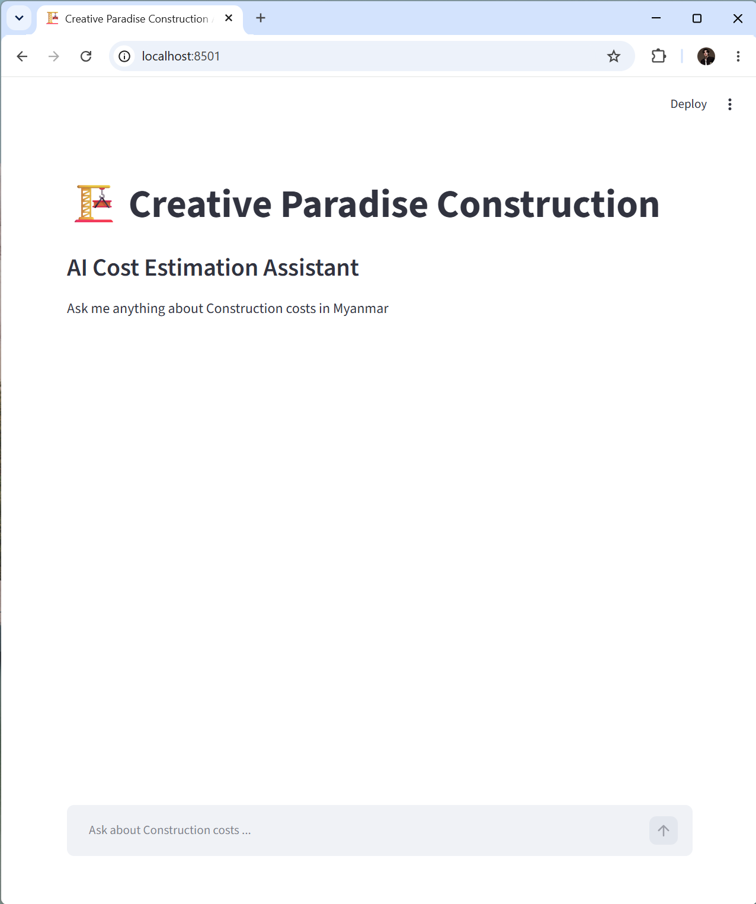
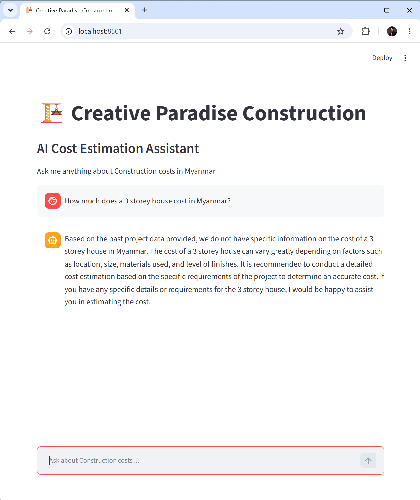
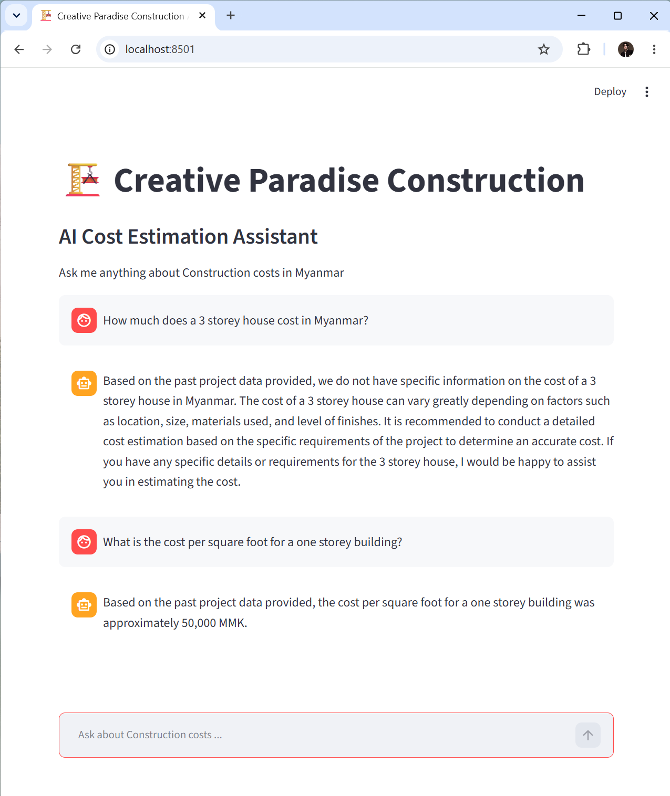
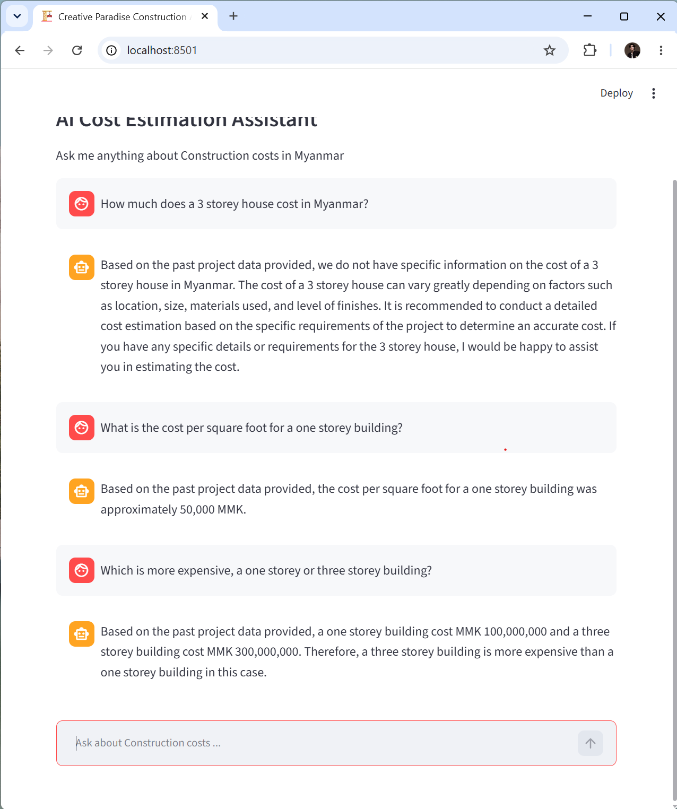
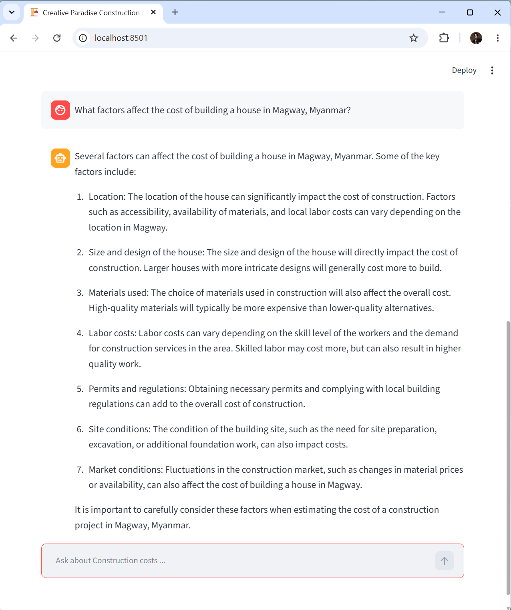

# 🏗️ Creative Paradise Construction AI

An Ai-powered construction cost estimation chatbot built for Creative Paradise Construction Co.,Ltd, Myanmar.

## What it does
- Answers construction cost questions in MMK (Myanmar Kyat)
- Uses real past proeject data from 6 completed projects
- Provides cost estimates for different build types
- Built with LangChain RAG pipeline + GPT-3.5

## Screnshoots

## Tech Stack
- Python 3.13
- LangChain + OpenAI GPT-3.5
- ChromaDB (Vector database)
- Streamlit (UI)
- openxyl (Excel data extraction)

## Project Structure
src/
├── ingest.py      ← reads real Excel BOQ files
├── retriever.py   ← RAG pipeline with LangChain
└── app.py         ← Streamlit chat interfac
